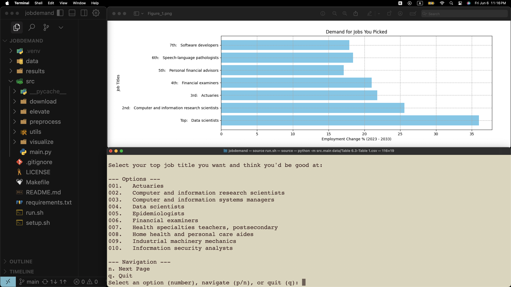

<div align="center">
    
    <h1>
        Jobdemand
    </h1>
</div>
A project that creates a visualization of the demand for each job the user picks to help them see what jobs are most in demand.


## Prerequiste
Please ensure Python 3 is installed on your machine. You can verify with the following command:
```bash
python -V # => Python 3.x.x
```

## Quick Setup
You can quickly create a local `.venv` virtual environment for this project with the dependencies needed with the following command:
```bash
source setup.sh
```

## Quick Run
You can quickly run the project, enter job titles, and generate your results with the following command:
```bash
source run.sh
```

## Specify Dataset to Run Against
Please decide on a `.csv` file you want pick your job titles for and run the following command replacing `6.x` with `6.1`,`6.2`, or `6.3`:
```bash
python -m src.main "Table 6.x-Table 1.csv"
```

## Credit
`data/skills.xlsx` file provided by the U.S. Bureau of Labor Statistics which you can download [here](https://www.bls.gov/emp/skills/skills.xlsx).